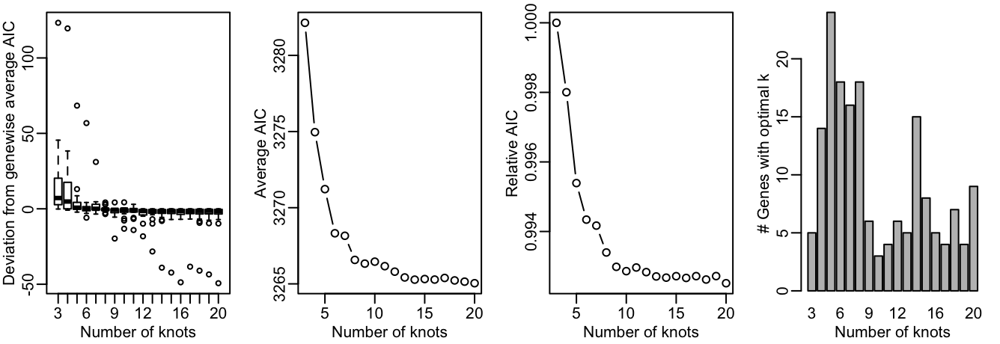

```{r, echo = FALSE}
library(knitr)
```

`tradeSeq` is an `R` package that allows analysis of gene expression along trajectories. While it has been developed and applied to single-cell RNA-sequencing (scRNA-seq) data, its applicability extends beyond that, and also allows the analysis of, e.g., single-cell ATAC-seq data along trajectories or bulk RNA-seq time series datasets. For every gene in the dataset, `tradeSeq` fits a generalized additive model (GAM) by building on the `mgcv` R package. It then allows statistical inference on the GAM by assessing contrasts of the parameters of the fitted GAM model, aiding in interpreting complex datasets. All details about the `tradeSeq` model and statistical tests are described in our preprint [@VandenBerge2019a].

In this vignette, we analyze a subset of the data from [@Paul2015]. 
A `SingleCellExperiment` object of the data has been provided with the [`tradeSeq`](https://github.com/statOmics/tradeSeqpaper) package and can be retrieved as shown below. The data and UMAP reduced dimensions were derived from following the [Monocle 3 vignette](http://cole-trapnell-lab.github.io/monocle-release/monocle3/#tutorial-1-learning-trajectories-with-monocle-3). 

In this vignette, we use `tradeSeq` downstream of `slinghsot`[@Street2018a] but it can be used downstream of any trajectory. In particular, if you want to use `tradeSeq` downstream of `monocle`[@Qiu2017] and `monocle3`[@Cao2019], please refer to our [Monocle vignette](https://bioconductor.org/packages/release/bioc/vignettes/tradeSeq/inst/doc/Monocle.html).

# Installation

To install the package, simply run

```{r, eval = FALSE}
if(!requireNamespace("BiocManager", quietly = TRUE)) {
 install.packages("BiocManager") 
}
BiocManager::install("tradeSeq")
```

# Load data

```{r, warning=F, message=F}
library(tradeSeq)
library(RColorBrewer)
library(SingleCellExperiment)
library(slingshot)

# For reproducibility
RNGversion("3.5.0")
palette(brewer.pal(8, "Dark2"))
data(countMatrix, package = "tradeSeq")
counts <- as.matrix(countMatrix)
rm(countMatrix)
data(crv, package = "tradeSeq")
data(celltype, package = "tradeSeq")
```

# Fit negative binomial model

Here we fit the `tradeSeq` negative binomial generalized additive model (NB-GAM). Please see the [fitGAM vignette](https://bioconductor.org/packages/release/bioc/vignettes/tradeSeq/inst/doc/fitGAM.html) for an extensive description on how to fit the models, tune its options and modify its output.

We first need to decide on the number of knots. This is done using the __evaluateK__ function. This takes a little time to run so it is not run here.

```{r, eval=FALSE}
set.seed(5)
icMat <- evaluateK(counts = counts, sds = crv, k = 3:10, 
                   nGenes = 200, verbose = T)
```

```{r, echo=FALSE}

```

For more explanation on the output from __evaluateK__, we refer users to the [fitGAM vignette](https://bioconductor.org/packages/release/bioc/vignettes/tradeSeq/inst/doc/fitGAM.html). Here, we pick `nknots = 6`.

We then fit the models by running the __fitGAM__ function. By default, the gene-wise NB-GAM estimates one smoother for every lineage using the negative binomial distribution. Please refer to the  [fitGAM vignette](https://bioconductor.org/packages/release/bioc/vignettes/tradeSeq/inst/doc/fitGAM.html) Additional to add additional covariates to the model, speed up computation or allow for custom normalization, amongst others.

```{r}
set.seed(7)
pseudotime <- slingPseudotime(crv, na = FALSE)
cellWeights <- slingCurveWeights(crv)
sce <- fitGAM(counts = counts, pseudotime = pseudotime, cellWeights = cellWeights,
                 nknots = 6, verbose = FALSE)
```


# Within-lineage comparisons

## Association of gene expression with pseudotime

A first exploration of the data analysis may consist of checking whether gene expression is associated with a particular lineage.
The statistical test performed here, implemented in the `associationTest` function, is testing the null hypothesis that all smoother coefficients are equal to each other. This can be interpreted as testing whether the average gene expression is significantly changing along pseudotime.

```{r}
assoRes <- associationTest(sce)
head(assoRes)
```


## Discovering progenitor marker genes

In order to discover marker genes of the progenitor or differentiated cell population, researchers may be interested in assessing differential expression between the progenitor cell population (i.e., the starting point of a lineage) with the differentiated cell type population (i.e., the end point of a lineage).
The function `startVsEndTest` uses a Wald test to assess the null hypothesis that the average expression at the starting point of the smoother (progenitor population) is equal to the average expression at the end point of the smoother (differentiated population).
The test basically involves a comparison between two smoother coefficients for every lineage.
The function `startVsEndTest` performs a global test across all lineages by default (i.e. it compares the start and end positions for all lineages simultaneously), but you can also assess all lineages separately by setting `lineages=TRUE`.
Below, we adopt an omnibus test across the two lineages.

```{r}
startRes <- startVsEndTest(sce)
```

We can visualize the estimated smoothers for the third most significant gene.

```{r, out.width="40%", fig.asp=1}
oStart <- order(startRes$waldStat, decreasing = TRUE)
sigGeneStart <- names(sce)[oStart[3]]
plotSmoothers(sce, counts, gene = sigGeneStart)
```

Alternatively, we can color the cells in UMAP space with that gene's expression.

```{r, out.width="50%", fig.asp=.5}
plotGeneCount(crv, counts, gene = sigGeneStart)
```

## Comparing specific pseudotime values within a lineage

The `startVsEndTest` compares two points on a lineage, and by default it is comparing the start point with the end point.
However, this is a specific form of a more general capability of the `startVsEndTest` to compare any two points on any lineage.
If the interest lies in comparing any two custom pseudotime values, one can specify this using the `pseudotimeValues` arguments in `startVsEndTest`.
For example, below we'd like to compare the expression for each gene at pseudotime values of $0.8$ and $0.1$.

```{r}
customRes <- startVsEndTest(sce, pseudotimeValues = c(0.1, 0.8))
```


# Between-lineage comparisons

## Discovering differentiated cell type markers

`tradeSeq` can discover marker genes for the differentiated cell types by comparing the average expression between end points of the lineage-specific smoothers. This is implemented in the `diffEndTest` function.
By default, `diffEndTest` performs a global test, testing the null hypothesis that the average expression at the endpoints is equal for all lineages using a multivariate Wald test.
If more than two lineages are present, one can assess all pairwise comparisons using the `pairwise=TRUE` argument.

```{r}
endRes <- diffEndTest(sce)
```

We can plot the most significant gene using the `plotSmoothers` function.

```{r, out.width="40%", fig.asp=1}
o <- order(endRes$waldStat, decreasing = TRUE)
sigGene <- names(sce)[o[1]]
plotSmoothers(sce, counts, sigGene)
```

Alternatively, we can color the cells in UMAP space with that gene's expression.

```{r, out.width="50%", fig.asp=.5}
plotGeneCount(crv, counts, gene = sigGene)
```

## Discovering genes with different expression patterns

Asides from testing at the level of the differentiated cell type, researchers may be interested in assessing the expression pattern of a gene over pseudotime.
The function `patternTest` implements a statistical method that checks whether the smoothed gene expression is equal along pseudotime between two or multiple lineages. In practice, we use $100$ points, equally distributed along pseudotime, that are compared between two (or multiple) lineages, and this number can be changed using the `nPoints` argument.

```{r, out.width="40%", fig.asp=1}
patternRes <- patternTest(sce)
oPat <- order(patternRes$waldStat, decreasing = TRUE)
head(rownames(patternRes)[oPat])
plotSmoothers(sce, counts, gene = rownames(patternRes)[oPat][4])
```

```{r, out.width="50%", fig.asp=.5}
plotGeneCount(crv, counts, gene = rownames(patternRes)[oPat][4])
```

We find genes at the top that are also ranked as DE for the differentiated cell type. What is especially interesting are genes that have different expression patterns but no different expression at the differentiated cell type level. We therefore sort the genes according to the sum of square of their rank in increasing Wald statistics for the `patternTest` and their rank in decreasing Wald statistics for the `diffEndTest`.

```{r, out.width="50%", fig.asp=.8}
library(dplyr)
library(ggplot2)
library(tidyr)

compare <- inner_join(patternRes %>% mutate(Gene = rownames(patternRes),
                                            pattern = waldStat) %>%
                                     select(Gene, pattern),
                      endRes %>% mutate(Gene = rownames(endRes),
                                        end = waldStat) %>%
                                 select(Gene, end),
                      by = c("Gene" = "Gene")) %>%
           mutate(transientScore = (min_rank(desc(end)))^2 +
                                   (dense_rank(pattern))^2)

ggplot(compare, aes(x = log(pattern), y = log(end))) +
  geom_point(aes(col = transientScore)) +
  labs(x = "patternTest Wald Statistic (log scale)",
       y = "diffEndTest Wald Statistic (log scale)") +
  scale_color_continuous(low = "yellow", high = "red") +
  theme_classic()
```

Or, we can visualize the expression in UMAP space of the top gene.

```{r, out.width="40%", fig.asp=1}
topTransient <- (compare %>% arrange(desc(transientScore)))[1, "Gene"]
plotSmoothers(sce, counts, gene = topTransient)
```

```{r, out.width="50%", fig.asp=.5}
plotGeneCount(crv, counts, gene = topTransient)
```

Interestingly, we recover the Irf8 gene in the top 5 genes according to that ranking.

```{r}
head(compare %>% arrange(desc(transientScore)) %>% select(Gene), n = 5)
```

We can also plot the Irf8 gene.

```{r, out.width="40%", fig.asp=1}
plotSmoothers(sce, counts, gene = "Irf8")
```

```{r, out.width="50%", fig.asp=.5}
plotGeneCount(crv, counts, gene = "Irf8")
```

## Early drivers of differentiation

Another question of interest is to find a list of genes that are differentially expressed between lineages at a particular region, e.g. around the separation of two or multiple lineages.
The function `earlyDETest` implements a statistical method to test the null hypothesis of whether the average gene expression smoothers are equal between lineages in a region defined by two user-specified knots.
Again, the knots can be visualized with the `plotGeneCount` function. By selecting the region covering the first two knot points to test for differential patterns between the lineages, we check which genes are behaving differently around the bifurcation point.

```{r, out.width="50%", fig.asp=.5}
plotGeneCount(curve = crv, counts = counts,
              clusters = apply(slingClusterLabels(crv), 1, which.max),
              models = sce)


earlyDERes <- earlyDETest(sce, knots = c(1, 2))
oEarly <- order(earlyDERes$waldStat, decreasing = TRUE)
head(rownames(earlyDERes)[oEarly])
```

```{r, out.width="40%", fig.asp=1}
plotSmoothers(sce, counts, gene = rownames(earlyDERes)[oEarly][2])
```

```{r, out.width="50%", fig.asp=.5}
plotGeneCount(crv, counts, gene = rownames(earlyDERes)[oEarly][2])
```


# Differential expression in large datasets

In large datasets with thousands of single cells, small fold changes can become statistically significant due to the very high sample size. However, these differences may not always be biologically meaningful.
To tackle this problem, all DE tests in  `tradeSeq` have an `l2fc` argument which specifies the absolute value of the log2 fold-change cut-off to test against.
For example, setting `l2fc=log2(2)` will test which genes have a fold change that is significantly higher than 2 or significantly lower than 1/2 within or between the lineages of interest.

```{r}
# testing against fold change threshold of 2
start2 <- startVsEndTest(sce, l2fc = log2(2))
# testing against fold change threshold of 1.5
pat2 <- patternTest(sce, l2fc = log2(1.5))
```


# Clustering of genes according to their expression pattern

## Extracting fitted values to use with any clustering method

While `tradeSeq` provides readily implemented functionality to cluster genes using the `clusterExperiment` package, users may want to cluster genes using other clustering methods.
Fitted values from the `tradeSeq` models, which can subsequently be used for clustering, can be extracted using the `predictSmooth` or `predictCells` functions.
`predictCells` predicts the estimated expression for each cell (i.e. it is a fitted value for that cell) on the count scale.
`predictSmooth`, instead, returns values of the estimated smoother on a grid of pseudotimes.
Either of these may be used as input to a clustering method; roughly, `predictSmooth` may be considered as a cleaner version of `predictCells`.

```{r}
yhat <- predictCells(models = sce, gene = "Irf8")

ysmooth <- predictSmooth(models = sce, gene = "Irf8", nPoints = 40)
```


## Clustering using RSEC, clusterExperiment

tradeSeq provides the functionality to cluster genes according to their expression pattern along the lineages with the `clusterExpressionPatterns` function. A number of equally spaced points for every lineage are selected to perform the clustering, and the number of points can be selected with the `nPoints` argument. The `genes` argument specifies which genes you want to cluster (e.g., all genes with differential expression patterns). Here, we use 20 points along each lineage to cluster the first 40 genes in the dataset.
The clustering itself occurs by the `clusterExperiment` package [@Risso2018], hence the user may select any clustering algorithm that's built into that package, or custom clustering algorithms implemented by the user. For a list of built-in clustering algorithms within `clusterExperiment`, run `clusterExperiment::listBuiltInFunctions()` on the command line.

```{r, warning=FALSE,message=F}
library(clusterExperiment)
nPointsClus <- 20
clusPat <- clusterExpressionPatterns(sce, nPoints = nPointsClus,
                                     genes = rownames(counts)[1:100])
clusterLabels <- primaryCluster(clusPat$rsec)
```

The first 4 clusters can be visualized using the normalized expression upon which the clustering is based. Please note that the code below would only works for a trajectory with two lineages. Modify the code appropriately if using with a dataset with 3 lineages or more. 

```{r, out.width="50%", fig.asp=1}
library(cowplot)
cUniq <- unique(clusterLabels)
cUniq <- cUniq[!cUniq == -1] # remove unclustered genes

plots <- list()
for (xx in cUniq[1:4]) {
  cId <- which(clusterLabels == xx)
  p <- ggplot(data = data.frame(x = 1:nPointsClus,
                                y = rep(range(clusPat$yhatScaled[cId, ]),
                                        nPointsClus / 2)),
              aes(x = x, y = y)) +
    geom_point(alpha = 0) +
    labs(title = paste0("Cluster ", xx),  x = "Pseudotime", y = "Normalized expression") +
    theme_classic()
  for (ii in 1:length(cId)) {
    geneId <- rownames(clusPat$yhatScaled)[cId[ii]]
    p <- p +
      geom_line(data = data.frame(x = rep(1:nPointsClus, 2),
                                  y = clusPat$yhatScaled[geneId, ],
                                  lineage = rep(0:1, each = nPointsClus)),
                aes(col = as.character(lineage), group = lineage), lwd = 1.5)
  }
  p <- p + guides(color = FALSE) +
    scale_color_manual(values = c("orange", "darkseagreen3"),
                       breaks = c("0", "1"))  
  plots[[as.character(xx)]] <- p
}
plots$ncol <- 2
do.call(plot_grid, plots)
```

# Contributing and requesting

A number of tests have been implemented in tradeSeq, but researchers may be interested in other hypotheses that current implementations may not be able to address. We therefore welcome contributions on GitHub on novel tests based on the tradeSeq model. Similar, you may also request novel tests to be implemented in tradeSeq by the developers, preferably by adding [an issue on the GitHub repository](https://github.com/statOmics/tradeSeq/issues). If we feel that the suggested test is widely applicable, we will implement it in tradeSeq.

# Session

```{r}
sessionInfo()
```

# References
